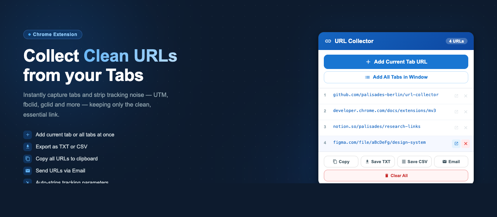

  

# URL Collector

A Chrome extension that collects clean URLs from your browser tabs — automatically stripping tracking and noise parameters (UTM, fbclid, gclid, etc.) before saving them.

## Features

- **Add current tab** — saves the active tab's URL to your list with one click
- **Add all tabs** — collects all open tabs in the current window at once, skipping duplicates
- **Tracking parameter removal** — strips UTM, Google Ads, Facebook, Microsoft Ads, and other common tracking params
- **Copy** — copies the full list to your clipboard, one URL per line
- **Save TXT** — saves your URL list as a `urls.txt` file
- **Save CSV** — saves your URL list as a `urls.csv` file (with header row)
- **Email** — opens your email client with all URLs pre-filled in the message body
- **Clear All** — removes all collected URLs (with confirmation step)

## Installation

Install directly from the **[Chrome Web Store](https://chromewebstore.google.com/detail/url-collector/ogdnmkpapoohpgdjkghaebfbgiklichl)**.

Alternatively, you can load it manually (Chrome Developer Mode):

1. [Download or clone this repository](https://github.com/palisades-berlin/url-collector/archive/refs/heads/main.zip) and unzip it
2. Open Chrome and navigate to `chrome://extensions`
3. Enable **Developer mode** using the toggle in the top-right corner
4. Click **Load unpacked**
5. Select the `url-collector` folder

The extension icon will appear in your toolbar. Pin it for easy access.

## Usage

1. Navigate to any tab you want to collect
2. Click the URL Collector icon to open the popup
3. Click **Add Current Tab URL** — the clean URL is added to your list
4. Repeat for as many tabs as you like
5. Click **Copy All** to copy the list to your clipboard
